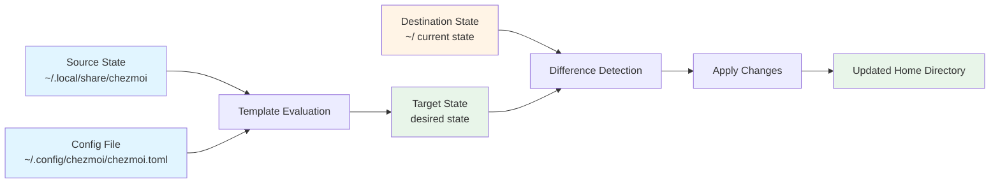
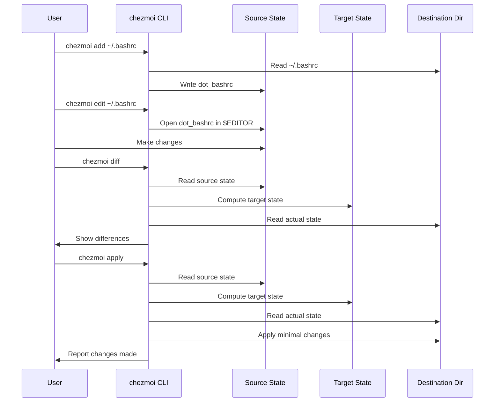

chezmoi uses a declarative approach to manage your dotfiles. It computes the target state for the current machine and then updates the destination directory to match.

## Core concepts

<AccordionGroup>
  <Accordion title="Destination directory" icon="house">
    The directory that chezmoi manages, usually your home directory (`~`).
  </Accordion>
  
  <Accordion title="Target" icon="bullseye">
    A file, directory, or symlink in the destination directory that chezmoi manages.
  </Accordion>
  
  <Accordion title="Destination state" icon="folder">
    The current state of all the targets in the destination directory.
  </Accordion>
  
  <Accordion title="Source state" icon="code-branch">
    Declares the desired state of your home directory, including templates that use machine-specific data. It contains only regular files and directories.
  </Accordion>
  
  <Accordion title="Source directory" icon="folder-tree">
    Where chezmoi stores the source state. By default it is `~/.local/share/chezmoi`.
  </Accordion>
  
  <Accordion title="Config file" icon="file-code">
    Contains machine-specific data. By default it is `~/.config/chezmoi/chezmoi.toml`.
  </Accordion>
  
  <Accordion title="Target state" icon="crosshairs">
    The desired state of the destination directory. It is computed from the source state, the config file, and the destination state. The target state includes regular files and directories, and may also include symbolic links, scripts to be run, and targets to be removed.
  </Accordion>
  
  <Accordion title="Working tree" icon="diagram-project">
    The git working tree. Normally it is the same as the source directory, but can be a parent of the source directory.
  </Accordion>
</AccordionGroup>

## State flow diagram

Here's how chezmoi transforms your source state into your destination state:



## Understanding entries

chezmoi uses the generic term **entry** to describe something that it manages. Entries can be:

- Files
- Directories
- Symlinks
- Scripts
- Remove operations

### Entry types in source state

<Columns cols={2}>
  <Card title="SourceStateFile" icon="file">
    Regular files in the source directory. Include attributes parsed from the file name (like `dot_`, `executable_`, `encrypted_`).
  </Card>
  
  <Card title="SourceStateDir" icon="folder">
    Directories in the source directory. Include attributes parsed from the directory name (like `exact_`, `private_`).
  </Card>
</Columns>

### Entry types in target state

<Columns cols={2}>
  <Card title="TargetStateFile" icon="file-lines">
    A file with contents and permissions in the destination.
  </Card>
  
  <Card title="TargetStateDir" icon="folder-open">
    A directory in the destination.
  </Card>
  
  <Card title="TargetStateSymlink" icon="link">
    A symbolic link in the destination.
  </Card>
  
  <Card title="TargetStateScript" icon="terminal">
    A script that should be executed.
  </Card>
  
  <Card title="TargetStateRemove" icon="trash">
    An entry that should be removed from the destination.
  </Card>
</Columns>

### Actual state entries

<Info>
The actual state represents what currently exists in your destination directory.
</Info>

- `ActualStateAbsent`: Entry does not exist
- `ActualStateDir`: Entry is a directory
- `ActualStateFile`: Entry is a file
- `ActualStateSymlink`: Entry is a symlink

## Source state attributes

chezmoi encodes metadata about files using special prefixes and suffixes in filenames. This is how a regular file becomes a dotfile, executable, or template.

### Common prefixes

| Prefix | Effect | Example |
|--------|--------|--------|
| `dot_` | Rename to use a leading dot | `dot_bashrc` → `.bashrc` |
| `executable_` | Add executable permissions | `executable_script.sh` → executable file |
| `private_` | Remove all group and world permissions | `private_key` → mode 600 |
| `readonly_` | Remove all write permissions | `readonly_config` → read-only file |
| `encrypted_` | File is encrypted in source state | `encrypted_secrets.txt.age` |
| `empty_` | Ensure file exists even if empty | `empty_file` |
| `create_` | Create if doesn't exist, don't modify if it does | `create_config.json` |
| `modify_` | Run as script to modify existing file | `modify_settings.sh` |
| `remove_` | Remove the entry if it exists | `remove_oldfile` |
| `run_` | Execute as a script | `run_setup.sh` |
| `symlink_` | Create a symbolic link | `symlink_config` |
| `exact_` | Remove anything not managed by chezmoi | `exact_directory/` |

### Script-specific prefixes

<Columns cols={2}>
  <Card title="run_once_" icon="1">
    Only run if contents haven't been run successfully before.
  </Card>
  
  <Card title="run_onchange_" icon="arrows-rotate">
    Run whenever the script contents change.
  </Card>
  
  <Card title="before_" icon="backward">
    Execute before updating files.
  </Card>
  
  <Card title="after_" icon="forward">
    Execute after all files are updated.
  </Card>
</Columns>

### Common suffixes

| Suffix | Effect |
|--------|--------|
| `.tmpl` | Treat file contents as a Go template |
| `.literal` | Stop parsing suffix attributes |

### Prefix order matters

<Warning>
Prefixes must be in the correct order. chezmoi will not recognize incorrectly ordered attributes.
</Warning>

<Tabs>
  <Tab title="Regular file">
    ```
    encrypted_private_readonly_empty_executable_dot_filename.tmpl
    ```
    Order: `encrypted_` → `private_` → `readonly_` → `empty_` → `executable_` → `dot_`
  </Tab>
  
  <Tab title="Create file">
    ```
    create_encrypted_private_readonly_empty_executable_dot_config.json.tmpl
    ```
    Order: `create_` → `encrypted_` → `private_` → `readonly_` → `empty_` → `executable_` → `dot_`
  </Tab>
  
  <Tab title="Script">
    ```
    run_once_before_install-packages.sh.tmpl
    ```
    Order: `run_` → `once_` or `onchange_` → `before_` or `after_`
  </Tab>
  
  <Tab title="Directory">
    ```
    exact_private_readonly_dot_config/
    ```
    Order: `remove_` → `external_` → `exact_` → `private_` → `readonly_` → `dot_`
  </Tab>
</Tabs>

## The apply workflow

When you run `chezmoi apply`, here's what happens:

<Steps>
  <Step title="Read source state">
    chezmoi reads all files and directories from the source directory (`~/.local/share/chezmoi`).
  </Step>
  
  <Step title="Parse attributes">
    For each entry, chezmoi parses the filename to extract attributes (prefixes and suffixes).
  </Step>
  
  <Step title="Execute templates">
    Files with `.tmpl` suffix are executed as Go templates using data from the config file and built-in variables.
  </Step>
  
  <Step title="Compute target state">
    Each source state entry computes its corresponding target state entry (what it should be in your home directory).
  </Step>
  
  <Step title="Read actual state">
    chezmoi reads the current state of each target in the destination directory.
  </Step>
  
  <Step title="Compare states">
    chezmoi compares the target state with the actual state to determine what changes are needed.
  </Step>
  
  <Step title="Apply changes">
    chezmoi applies the minimal set of changes to make the actual state match the target state:
    - Create missing files/directories
    - Update modified files
    - Remove extra files (in `exact_` directories)
    - Execute scripts
    - Update permissions
  </Step>
  
  <Step title="Update persistent state">
    chezmoi stores the SHA256 hash of each entry it writes in persistent state for future change detection.
  </Step>
</Steps>

<Tip>
All file operations are atomic. You will never be left with incomplete files, even if the process is interrupted.
</Tip>

## System abstraction

chezmoi abstracts all operating system interactions through a `System` interface. This enables powerful features:

### System implementations

<AccordionGroup>
  <Accordion title="RealSystem">
    The actual underlying system that performs real file operations.
  </Accordion>
  
  <Accordion title="DryRunSystem">
    Wraps RealSystem for `--dry-run` mode. Allows reads to pass through but silently discards all writes.
  </Accordion>
  
  <Accordion title="DebugSystem">
    Wraps RealSystem for `--debug` mode. Logs all calls to the underlying system.
  </Accordion>
</AccordionGroup>

<Note>
This layered architecture is what makes features like `--dry-run` and `--debug` possible without modifying the core logic.
</Note>

## Persistent state

chezmoi maintains a persistent state to track what it has managed. This is stored as a two-level key-value store:

```
map[Bucket]map[Key]Value
```

### Why persistent state?

<Columns cols={2}>
  <Card title="Change detection" icon="magnifying-glass">
    Detect if a third party has modified a file since chezmoi last wrote it.
  </Card>
  
  <Card title="Script execution" icon="list-check">
    Track which `run_once_` and `run_onchange_` scripts have been executed.
  </Card>
</Columns>

### EntryState storage

<Info>
chezmoi stores the SHA256 hash of each entry's contents in persistent state, rather than the full contents, to avoid storing secrets.
</Info>

## Path handling

chezmoi uses type-safe path handling to prevent errors:

- `AbsPath`: Absolute paths
- `RelPath`: Relative paths
- `SourceRelPath`: Relative path within the source directory with attribute handling
- `ExtPath`: External paths from user input (may include `~` for home directory)

<Warning>
Internally, chezmoi normalizes all paths to use forward slashes and is case-sensitive. It makes no attempt to handle case-insensitive or case-preserving file systems.
</Warning>

## Execution order

chezmoi performs actions in a deterministic order:

<Steps>
  <Step title="Before scripts">
    Execute all `run_before_` scripts in ASCII order of their target names.
  </Step>
  
  <Step title="Files, directories, symlinks">
    Process in ASCII order of target names.
  </Step>
  
  <Step title="Regular scripts">
    Execute `run_` scripts (without `before_` or `after_`) in ASCII order alongside files.
  </Step>
  
  <Step title="After scripts">
    Execute all `run_after_` scripts in ASCII order of their target names.
  </Step>
</Steps>

<Tip>
**Example**: Given `dot_a` (file), `run_z.sh` (script), and `exact_dot_c/` (directory), chezmoi will:
1. Create `.a`
2. Create `.c/` directory
3. Execute `run_z.sh`
</Tip>

## Encryption support

Encryption tools are abstracted through an `Encryption` interface:

<Columns cols={2}>
  <Card title="AGE encryption" icon="lock">
    Modern, simple file encryption with `age`.
  </Card>
  
  <Card title="GPG encryption" icon="key">
    Traditional encryption with GnuPG.
  </Card>
</Columns>

Encrypted files in the source state have their encryption suffix (`.age` or `.asc`) automatically stripped when determining the target name.

## Interactive workflow diagram



## Key takeaways

<Check>
**Declarative**: You specify what you want, chezmoi figures out how to get there.
</Check>

<Check>
**Idempotent**: Running `chezmoi apply` multiple times produces the same result.
</Check>

<Check>
**Safe**: Dry-run mode, atomic operations, and persistent state tracking prevent accidents.
</Check>

<Check>
**Flexible**: Templates, attributes, and scripts provide powerful customization.
</Check>

<Tip>
Ready to dive deeper? Explore the [configuration reference](/reference/configuration-file) for complete details on all attributes, [template functions](/reference/templates/functions), and configuration options.
</Tip>