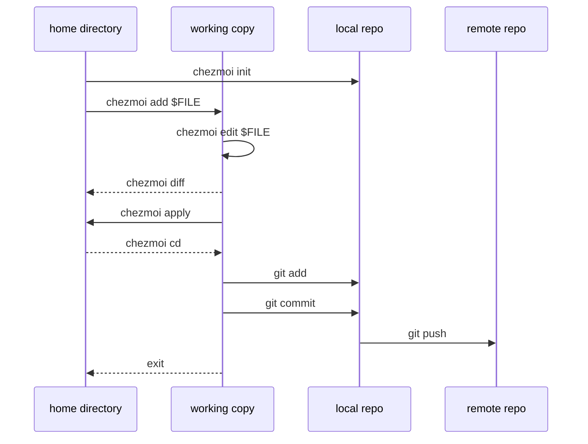
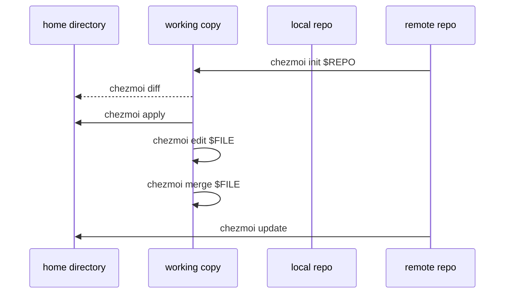
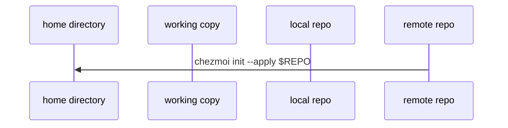

# Quick Start Guide

This guide will help you start using chezmoi to manage your dotfiles on your current machine and then sync them across multiple machines.

## Concepts

Roughly speaking, chezmoi stores the desired state of your dotfiles in the directory `~/.local/share/chezmoi`. When you run `chezmoi apply`, chezmoi calculates the desired contents for each of your dotfiles and then makes the minimum changes required to make your dotfiles match your desired state.

<Note>
For a more detailed explanation, see the [concepts reference](https://chezmoi.io/reference/concepts/).
</Note>

## Start Using chezmoi on Your Current Machine

Assuming you have already [installed chezmoi](/install), follow these steps to start managing your dotfiles:

<Steps>
  <Step title="Initialize chezmoi">
    Create a new git repository where chezmoi will store its source state:

    ```bash
    chezmoi init
    ```

    This creates a new git local repository in `~/.local/share/chezmoi`. By default, chezmoi only modifies files in the working copy.
  </Step>

  <Step title="Manage your first file">
    Add your first dotfile to chezmoi:

    ```bash
    chezmoi add ~/.bashrc
    ```

    This will copy `~/.bashrc` to `~/.local/share/chezmoi/dot_bashrc`.
  </Step>

  <Step title="Edit the source state">
    Edit the file in chezmoi's source directory:

    ```bash
    chezmoi edit ~/.bashrc
    ```

    This will open `~/.local/share/chezmoi/dot_bashrc` in your `$EDITOR`. Make some changes and save the file.

    <Tip>
    You don't have to use `chezmoi edit` to edit your dotfiles. You can edit them directly in the source directory or use your preferred editor workflow.
    </Tip>
  </Step>

  <Step title="Preview changes">
    See what changes chezmoi would make:

    ```bash
    chezmoi diff
    ```

    This shows you exactly what will change before you apply it.
  </Step>

  <Step title="Apply the changes">
    Apply your changes to your home directory:

    ```bash
    chezmoi -v apply
    ```

    The `-v` (verbose) flag prints out exactly what changes are being made. You can also use `-n` (dry run) to see what would happen without making actual changes.

    <Info>
    The combination `-n -v` is very useful to see exactly what changes would be made without making them.
    </Info>
  </Step>

  <Step title="Commit your changes">
    Open a shell in the source directory to commit your changes:

    ```bash
    chezmoi cd
    git add .
    git commit -m "Initial commit"
    ```
  </Step>

  <Step title="Create a GitHub repository">
    [Create a new repository on GitHub](https://github.com/new) called `dotfiles` and push your repo:

    ```bash
    git remote add origin git@github.com:$GITHUB_USERNAME/dotfiles.git
    git branch -M main
    git push -u origin main
    ```

    <Tip>
    chezmoi can be configured to automatically [add, commit, and push](https://chezmoi.io/user-guide/daily-operations/#automatically-commit-and-push-changes-to-your-repo) changes to your repo.
    </Tip>
  </Step>

  <Step title="Exit the source directory">
    Return to where you were:

    ```bash
    exit
    ```
  </Step>
</Steps>

### Workflow Diagram

This diagram summarizes the workflow:



## Using chezmoi Across Multiple Machines

Once you've set up chezmoi on your first machine, you can easily sync your dotfiles to other machines.

<Steps>
  <Step title="Initialize with your dotfiles repo">
    On a second machine, initialize chezmoi with your dotfiles repo:

    ```bash
    chezmoi init https://github.com/$GITHUB_USERNAME/dotfiles.git
    ```

    <Warning>
    Private GitHub repos require authentication. Use SSH:

    ```bash
    chezmoi init git@github.com:$GITHUB_USERNAME/dotfiles.git
    ```
    </Warning>

    This will check out the repo and any submodules and optionally create a chezmoi config file for you.
  </Step>

  <Step title="Review changes">
    Check what changes chezmoi will make to your home directory:

    ```bash
    chezmoi diff
    ```
  </Step>

  <Step title="Apply changes">
    If you're happy with the changes, apply them:

    ```bash
    chezmoi apply -v
    ```
  </Step>

  <Step title="Edit files if needed">
    If you're not happy with changes to a specific file, you can:

    **Edit the file:**
    ```bash
    chezmoi edit $FILE
    ```

    **Or merge changes:**
    ```bash
    chezmoi merge $FILE
    ```

    This invokes a merge tool (by default `vimdiff`) to merge changes between the current contents of the file, the file in your working copy, and the computed contents.
  </Step>

  <Step title="Keep machines in sync">
    Pull and apply the latest changes from your repo:

    ```bash
    chezmoi update -v
    ```
  </Step>
</Steps>

### Multi-Machine Workflow Diagram



## Set Up a New Machine with a Single Command

You can install your dotfiles on a new machine with a single command:

<CodeGroup>
  ```bash Full GitHub URL
  chezmoi init --apply https://github.com/$GITHUB_USERNAME/dotfiles.git
  ```

  ```bash GitHub Shorthand
  chezmoi init --apply $GITHUB_USERNAME
  ```

  ```bash Private Repo (SSH)
  chezmoi init --apply git@github.com:$GITHUB_USERNAME/dotfiles.git
  ```
</CodeGroup>

<Note>
If you use GitHub and your dotfiles repo is called `dotfiles`, you can use the shorthand `$GITHUB_USERNAME` instead of the full URL.
</Note>

### Single-Command Setup Diagram



## Common Commands Reference

<AccordionGroup>
  <Accordion title="Verbose and Dry Run Flags" icon="flag">
    All chezmoi commands accept these useful flags:

    - `-v` or `--verbose`: Print out exactly what changes will be made
    - `-n` or `--dry-run`: Don't make any actual changes
    - `-n -v`: Combination to see exactly what would change without making changes

    Example:
    ```bash
    chezmoi -n -v apply
    ```
  </Accordion>

  <Accordion title="Essential Commands" icon="terminal">
    - `chezmoi init`: Initialize chezmoi
    - `chezmoi add <file>`: Add a file to chezmoi
    - `chezmoi edit <file>`: Edit a file in the source state
    - `chezmoi diff`: Show what would change
    - `chezmoi apply`: Apply changes to your home directory
    - `chezmoi update`: Pull and apply latest changes from repo
    - `chezmoi cd`: Open a shell in the source directory
  </Accordion>

  <Accordion title="Working with Git" icon="git">
    chezmoi works seamlessly with Git. You can use chezmoi to manage your dotfiles repo:

    ```bash
    # Enter the source directory
    chezmoi cd

    # Use git commands as normal
    git status
    git add .
    git commit -m "Update dotfiles"
    git push

    # Exit back to where you were
    exit
    ```

    <Tip>
    chezmoi can be configured to [automatically commit and push](https://chezmoi.io/user-guide/daily-operations/#automatically-commit-and-push-changes-to-your-repo) changes.
    </Tip>
  </Accordion>

  <Accordion title="Git Hosting Services" icon="server">
    chezmoi works with any git hosting service:

    - [GitHub](https://github.com)
    - [GitLab](https://gitlab.com)
    - [Bitbucket](https://bitbucket.org)
    - [Source Hut](https://sr.ht/)
    - Any self-hosted git server
  </Accordion>
</AccordionGroup>

## Next Steps

For a full list of commands, run:

```bash
chezmoi help
```

chezmoi has much more functionality to explore:

<CardGroup cols={2}>
  <Card title="User Guide" icon="book" href="https://chezmoi.io/user-guide/setup/">
    Learn about templates, secrets management, and advanced features
  </Card>
  <Card title="Command Overview" icon="terminal" href="https://chezmoi.io/user-guide/command-overview/">
    Complete reference of all chezmoi commands
  </Card>
  <Card title="Daily Operations" icon="calendar" href="https://chezmoi.io/user-guide/daily-operations/">
    Day-to-day workflows and best practices
  </Card>
  <Card title="Example Repos" icon="github" href="https://chezmoi.io/links/dotfile-repos/">
    See how other people use chezmoi
  </Card>
</CardGroup>

<Tip>
Good next steps include adding more dotfiles, using templates to manage files that vary from machine to machine, and learning how to retrieve secrets from your password manager.
</Tip>
