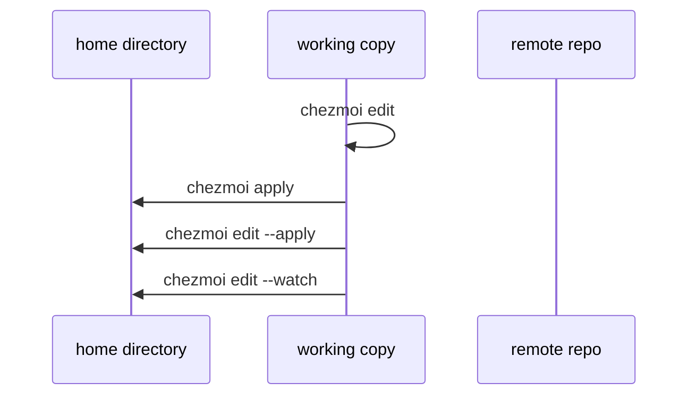
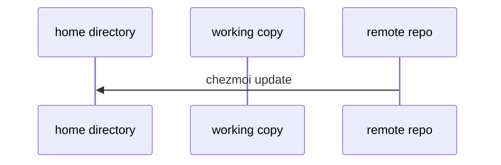
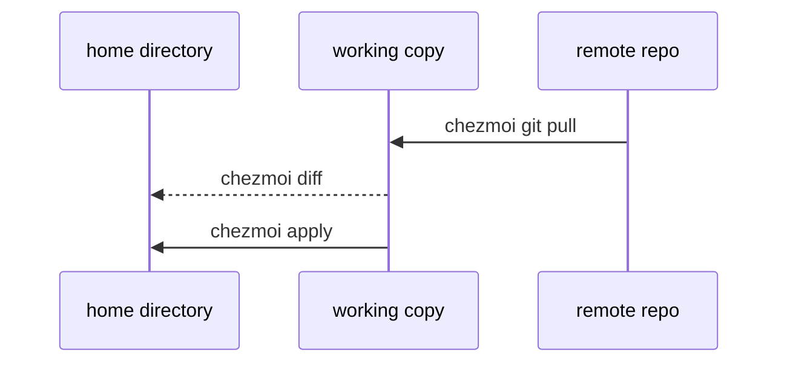
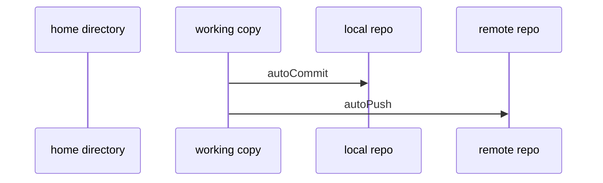
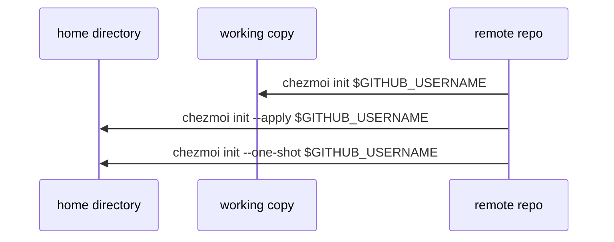

## Edit your dotfiles

Edit managed files using the `chezmoi edit` command:

<Tabs>
  <Tab title="Basic edit">
    ```bash
    chezmoi edit $FILENAME
    ```

    This opens the source file in your editor. Changes aren't applied until you run `chezmoi apply`.
  </Tab>

  <Tab title="Edit and apply">
    ```bash
    chezmoi edit --apply $FILENAME
    ```

    Automatically applies changes when you quit the editor.
  </Tab>

  <Tab title="Edit with watch">
    ```bash
    chezmoi edit --watch $FILENAME
    ```

    Automatically applies changes every time you save in the editor.
  </Tab>
</Tabs>

<Note>
You don't have to use `chezmoi edit`. You can edit files directly in the source directory (`~/.local/share/chezmoi`) and apply changes later.
</Note>



## Pull the latest changes from your repo and apply them

<CodeGroup>
```bash Update in one command
chezmoi update
```

```bash What it does
# Equivalent to:
git pull --autostash --rebase  # in source directory
chezmoi apply                  # apply changes
```
</CodeGroup>



## Pull and preview changes without applying

<Steps>
  <Step title="Pull changes and preview">
    ```bash
    chezmoi git pull -- --autostash --rebase && chezmoi diff
    ```

    This shows what would change without modifying your files.
  </Step>

  <Step title="Apply if satisfied">
    ```bash
    chezmoi apply
    ```
  </Step>
</Steps>



## Automatically commit and push changes to your repo

Enable auto-commit and auto-push in your config file:

<CodeGroup>
```toml ~/.config/chezmoi/chezmoi.toml
[git]
    autoCommit = true
    autoPush = true
```

```toml Custom commit messages
[git]
    autoCommit = true
    commitMessageTemplate = "{{ promptString \"Commit message\" }}"
```

```toml Commit message from file
[git]
    autoCommit = true
    commitMessageTemplateFile = ".commit_message.tmpl"
```
</CodeGroup>

Behavior:
- `autoCommit = true`: Commits changes with auto-generated messages
- `autoPush = true`: Commits and pushes (implies `autoCommit`)
- Custom templates: Prompt for messages or use template files

<Warning>
Be careful with `autoPush` on public repos. Accidentally committing secrets in plain text will push them immediately.
</Warning>



## Install chezmoi and your dotfiles on a new machine with a single command

<Tabs>
  <Tab title="Install and apply">
    For a repo named `dotfiles` on GitHub:

    ```bash
    sh -c "$(curl -fsLS get.chezmoi.io)" -- init --apply $GITHUB_USERNAME
    ```

    This installs chezmoi, runs `chezmoi init`, and applies your dotfiles in one command.
  </Tab>

  <Tab title="One-shot mode">
    For transitory environments (containers, temporary VMs):

    ```bash
    sh -c "$(curl -fsLS get.chezmoi.io)" -- init --one-shot $GITHUB_USERNAME
    ```

    This installs dotfiles then removes all traces of chezmoi, including the source directory.
  </Tab>

  <Tab title="Custom repo">
    For non-GitHub repos or different repo names:

    ```bash
    sh -c "$(curl -fsLS get.chezmoi.io)" -- init --apply https://gitlab.com/username/my-dotfiles.git
    ```
  </Tab>
</Tabs>



<Tip>
The one-shot mode is perfect for Docker containers or cloud shells where you need your config temporarily.
</Tip>