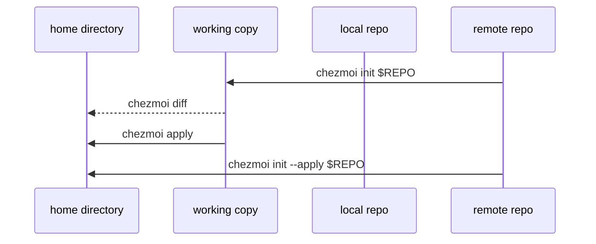

## Understand chezmoi's files and directories

chezmoi generates your dotfiles for your local machine by combining two main sources of data:

**Source directory** (`~/.local/share/chezmoi`)
- Common to all your machines
- A clone of your dotfiles repo
- Each managed file has a corresponding source file here

**Config file** (`~/.config/chezmoi/chezmoi.toml`)
- Specific to the local machine
- Can also use JSON or YAML format
- Contains machine-specific variables

Files with identical contents across machines are copied verbatim. Files that vary are executed as templates, using data from the config file to customize content for each machine.

## Use a hosted repo to manage your dotfiles across multiple machines

chezmoi uses version control to share changes across machines. You should create a repo on your preferred platform (GitHub, GitLab, Bitbucket) to store your dotfiles.

<Steps>
  <Step title="Push your dotfiles to a remote repo">
    Navigate to your source directory and add a remote:

    ```bash
    chezmoi cd
    git remote add origin https://github.com/$GITHUB_USERNAME/dotfiles.git
    git push -u origin main
    exit
    ```
  </Step>

  <Step title="Initialize chezmoi on another machine">
    Clone your dotfiles repo:

    ```bash
    chezmoi init https://github.com/$GITHUB_USERNAME/dotfiles.git
    ```
  </Step>

  <Step title="Preview and apply changes">
    <Tabs>
      <Tab title="Preview changes">
        See what would be changed:

        ```bash
        chezmoi diff
        ```
      </Tab>

      <Tab title="Apply changes">
        If you're happy with the changes:

        ```bash
        chezmoi apply
        ```
      </Tab>

      <Tab title="All in one">
        Initialize, checkout, and apply in a single command:

        ```bash
        chezmoi init --apply --verbose https://github.com/$GITHUB_USERNAME/dotfiles.git
        ```
      </Tab>
    </Tabs>
  </Step>
</Steps>



## Use a private repo to store your dotfiles

chezmoi supports both public and private repos. For security:

- Store secrets in password managers or encrypted files
- Keep private data in machine-specific config files
- Your dotfiles repo can remain public

<Note>
When using a private GitHub repo without SSH, you'll need to use a [GitHub personal access token](https://docs.github.com/en/authentication/keeping-your-account-and-data-secure/creating-a-personal-access-token) instead of your password.
</Note>

## Create a config file on a new machine automatically

Automate config file creation by adding a `.chezmoi.toml.tmpl` template to your repo:

<CodeGroup>
```toml ~/.local/share/chezmoi/.chezmoi.toml.tmpl
{{- $email := promptStringOnce . "email" "Email address" -}}

[data]
    email = {{ $email | quote }}
```

```toml Generated output
[data]
    email = "user@example.com"
```
</CodeGroup>

When you run `chezmoi init`, this template will generate your `chezmoi.toml` config file. The `promptStringOnce` function prompts for values not already set.

<Steps>
  <Step title="Test the template">
    Use `execute-template` to test without creating files:

    ```bash
    chezmoi execute-template --init --promptString "Email address=me@home.org" < ~/.local/share/chezmoi/.chezmoi.toml.tmpl
    ```
  </Step>

  <Step title="Re-create your config file">
    If you update the template, regenerate your config:

    ```bash
    chezmoi init
    ```

    Using `promptStringOnce` prevents re-prompting for existing values.
  </Step>
</Steps>

<Tip>
Supported config formats: `json`, `jsonc`, `toml`, and `yaml`. Name your template `.chezmoi.$FORMAT.tmpl`.
</Tip>